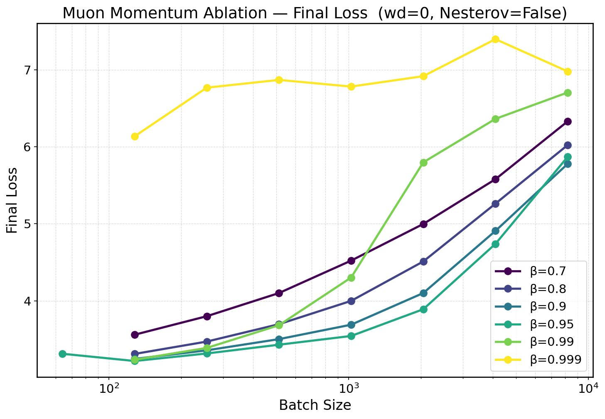
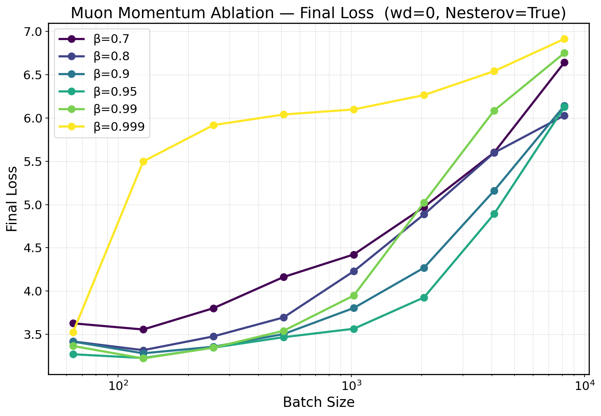
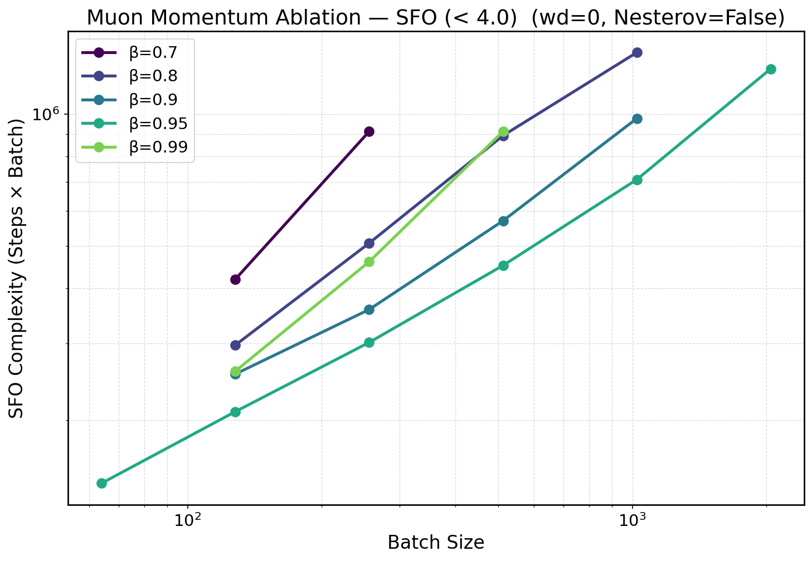
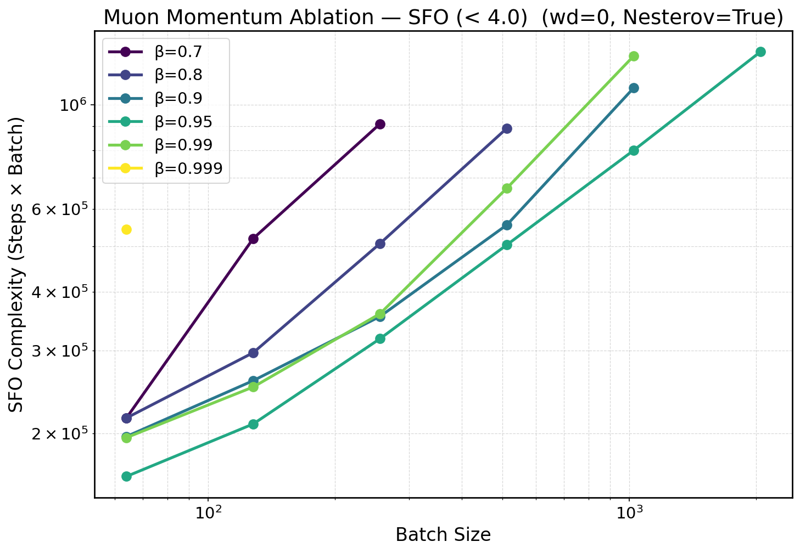

# Convergence Bounds and Critical Batch Size of Muon

This repository contains the source code for the experiments and analysis presented in the paper "Convergence Bounds and Critical Batch Size of Muon".

## Abstract

This paper presents a theoretical analysis of Muon, a new optimizer that respects the inherent matrix structure of neural network parameters. We give convergence proofs for four practical variants of Muon: with Nesterov momentum, without Nesterov momentum, with weight decay and without weight decay. We then show that adding weight decay leads to strictly tighter bounds on both the norm of the parameters and the norm of the gradients, and we describe the relationship between the weight decay coefficient and the learning rate. Finally, we determine the optimal batch size for Muon and validate our theoretical findings with experiments.

## Additional Experiments (Llama3 160M on C4 Dataset)

We also conducted additional experiments on Llama3 160M on C4 Dataset. The results are shown in the following figure.

### Results

| Loss vs Batch Size | SFO Complexity vs Batch Size |
|:------------------:|:----------------------------:|
|  |  |

Both in terms of loss and SFO, Muon outperforms AdamW.
This performance gap becomes more pronounced with larger batch sizes.
In this experimental setting, incorporating Nesterov momentum or weight decay did not lead to significant improvements in either SFO or loss.


| Loss (WD=0, Nesterov=False) | Loss (WD=0, Nesterov=True) |
|:---------------------------:|:--------------------------:|
|  |  |

| SFO (WD=0, Nesterov=False) | SFO (WD=0, Nesterov=True) |
|:--------------------------:|:-------------------------:|
|  |  |

Experimental results show that a Muon momentum (β) of 0.95 yields the most favorable loss and SFO. As the momentum decreases, the critical batch size tends to increase; conversely, as the momentum increases, the critical batch size tends to decrease. However, excessively large or small momentum values do not lead to improvements in either loss or SFO.

<!-- WIP
<div style="display: flex; flex-wrap: wrap; gap: 20px;">
  <figure style="margin: 0; text-align: center; flex: 1;">
    
    <figcaption>Loss vs Batch Size (WD=0, Nesterov=False)</figcaption>
  </figure>
  <figure style="margin: 0; text-align: center; flex: 1;">
    
    <figcaption>Loss vs Batch Size (WD=0, Nesterov=True)</figcaption>
  </figure>
</div> -->


### Settings

We used the following settings:

- Model: Llama3 160M
- Dataset: C4 Dataset
- Batch size: 16, 32, 64, 128, 256, 512, 1024, 2048, 4096, 8192

### Code

## Repository Structure

- `image_classification/`: Contains the source code for the image classification experiments.
- `language_modeling/`: Contains the source code for the language modeling experiments.

## Usage

### Prerequisites

Install the required Python packages:
```bash
pip install -r requirements.txt
```

### Running Experiments

The experiment scripts are located in the respective cluster directories (e.g., `image_classification/slurm_cluster/`). These scripts are configured to run the training jobs on the cluster's queuing system.

For example, to run an experiment on the Slurm cluster:
```bash
cd image_classification/slurm_cluster/cbs_1gpu/
sbatch run_muon_with_nesterov_exp1.sh
```
